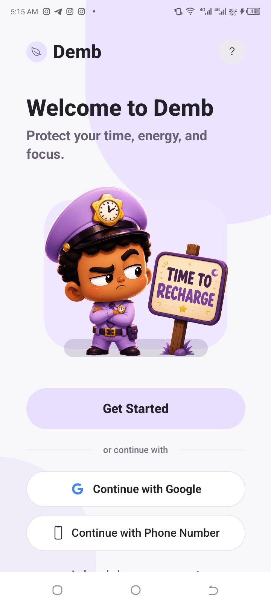
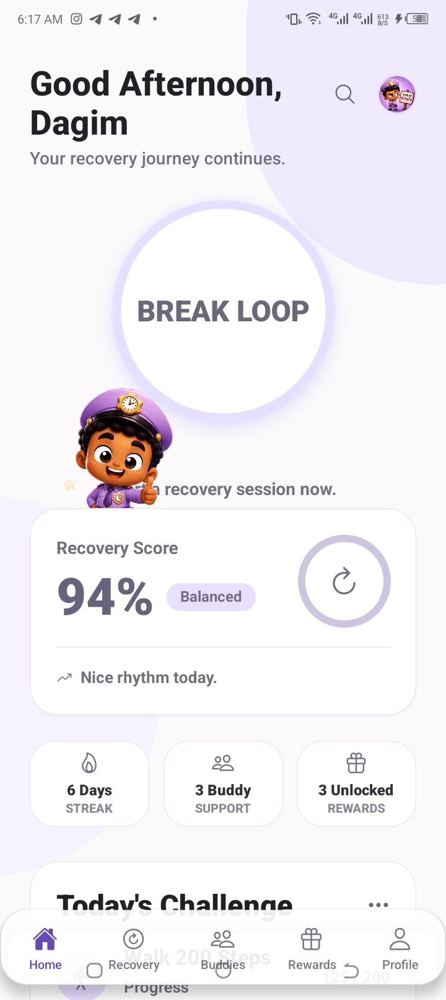
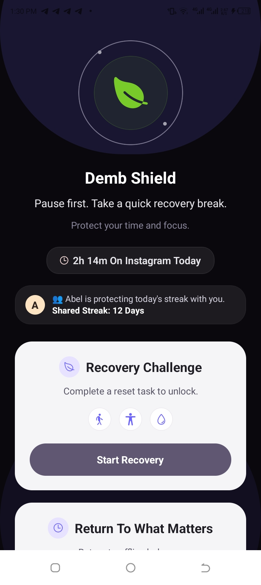
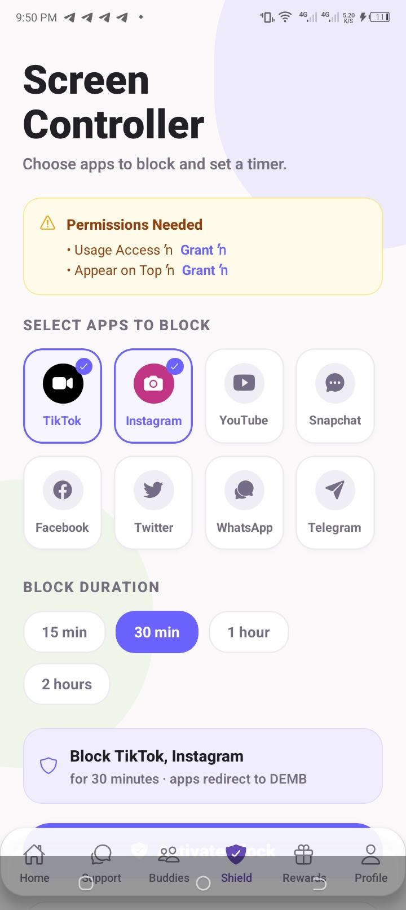
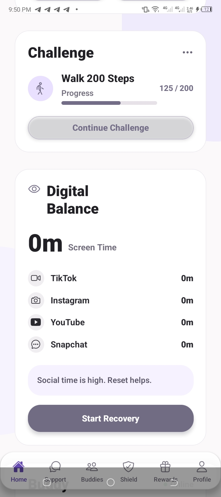
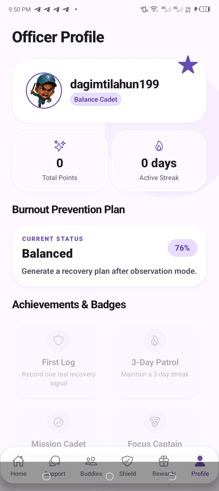
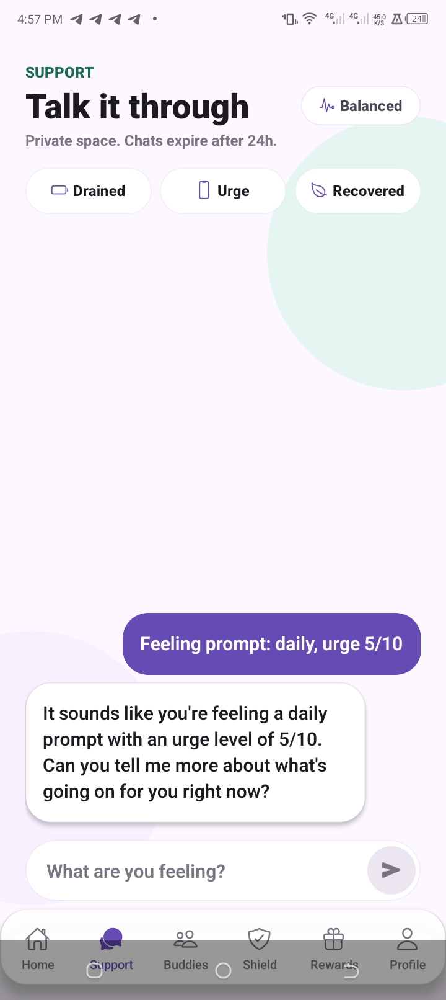

# Demb

<p align="center">
  
</p>

<h1 align="center">A Mobile App for Digital Wellbeing and Recovery</h1>

<p align="center">
Helping people regain control of their attention, focus, energy, and wellbeing in an increasingly distracting digital world.
</p>

---

## The Challenge

Technology has become an essential part of modern life, but many people struggle with:

- Excessive screen time
- Constant notifications
- Loss of focus
- Mental fatigue
- Burnout
- Digital dependency
- Difficulty maintaining healthy habits

Existing solutions often focus on tracking behavior or restricting access.

They tell people **what is happening**.

They rarely help people **change what happens next**.

---

## Our Solution

**Demb** is a mobile wellness app designed to help people build a healthier relationship with technology.

Instead of simply measuring screen time, Demb helps users:

- Understand their digital habits
- Recover from periods of distraction
- Improve focus and productivity
- Build sustainable routines
- Stay accountable through social support
- Receive personalized guidance through AI

Demb transforms wellbeing from something people think about occasionally into something they actively practice every day.

---

## Why Demb Matters

The world has built tools to manage:

- Money
- Tasks
- Meetings
- Files

Yet very few tools help people manage:

- Attention
- Energy
- Recovery
- Balance

As technology becomes more integrated into daily life, helping people maintain healthy digital habits becomes increasingly important.

Demb addresses this challenge by making wellbeing accessible directly from the device people use most: their smartphone.

---

## Key Features

### Digital Balance Dashboard

Provides meaningful insights into digital behavior and daily wellbeing patterns.

### Recovery Missions

Guided actions designed to help users regain focus and break unhealthy digital loops.

### AI Wellness Companion

Offers personalized support, recovery guidance, and practical recommendations.

### Accountability Circles

Encourages consistency through trusted friends, family members, and support groups.

### Progress & Rewards

Makes positive behavior visible through milestones, streaks, achievements, and growth tracking.

### Focus Protection

Helps users reduce distractions and create intentional periods of focused work and recovery.

---
## Screenshots

<p align="center">
  
  
  
</p>

<p align="center">
  
  
  
</p>

<p align="center">
  
</p>
The screenshots below show Demb’s core mobile experience, including onboarding, recovery guidance, AI support, accountability, focus tools, and progress tracking.
## Potential Impact

Digital wellbeing affects people of all ages.

Demb has the potential to support:

- Students struggling with distraction
- Professionals experiencing burnout
- Individuals building healthier habits
- Communities focused on wellbeing

By combining behavioral insights, AI support, accountability, and recovery-focused experiences, Demb aims to help users create lasting positive change rather than temporary restrictions.


> ⚠️ **Important Note **
>
> Demb is currently built and distributed using **Expo** to enable rapid development and testing during the hackathon.
>
> Some of Demb's planned capabilities rely on device-level Android features, sensors, and permissions that require a custom production build and cannot be fully demonstrated inside the standard Expo development environment.
>
> This release showcases the complete user experience, including onboarding, recovery missions, AI guidance, accountability circles, focus management, wellbeing tracking, and the overall product vision.
>
> While certain native integrations are reserved for future production builds, reviewers can explore and evaluate Demb's core functionality, user flows, and wellness framework through this version of the application
---

## Technology

### Mobile

- React Native
- Expo
- TypeScript
- Expo Router

### State & Storage

- Zustand
- SQLite

### Cloud Services

- Supabase
- Supabase Edge Functions

### AI Services

- FastAPI
- AI-powered recovery guidance

---

## Architecture

```text
.
├── AI/
├── assets/
├── plugins/
├── src/
│   ├── app/
│   ├── components/
│   ├── constants/
│   ├── types/
│   ├── utils/
│   ├── db.ts
│   └── store.ts
├── supabase/
├── app.json
├── eas.json
└── package.json
```

---

## Quick Start

### Requirements

- Node.js 20+
- npm
- Expo Go

### Installation

```bash
npm install
```

### Run

```bash
npm start
```

Scan the generated QR code using Expo Go.
.

---

## Vision

We believe the future of wellbeing is proactive rather than reactive.

Instead of waiting for people to experience burnout, distraction, or digital overload, technology should help them recognize unhealthy patterns early and take meaningful action.

Demb is designed around a simple idea:

**Technology should improve human wellbeing, not compete for human attention.**

---

## Roadmap

### Phase 1

- Digital Balance Dashboard
- Recovery Missions
- AI Wellness Companion
- Accountability Circles

### Phase 2

- Advanced personalization
- Device-level focus tools
- Wearable integrations
- Enhanced recovery intelligence

### Phase 3

- Predictive wellbeing insights
- Educational partnerships
- Workplace wellbeing solutions
- Large-scale wellness communities

---

## What Makes Demb Different

Many wellness apps focus on monitoring.

Many productivity apps focus on performance.

Demb focuses on helping people recover.

Recovery is often the missing piece between knowing a problem exists and actually solving it.

---

## Closing

Demb is more than a screen-time tracker and more than a productivity tool.

It is a mobile app designed to help people build healthier digital habits, improve focus, recover from digital overload, and create a more balanced relationship with technology.

Our goal is simple:

**Help people use technology intentionally instead of being controlled by it.**
